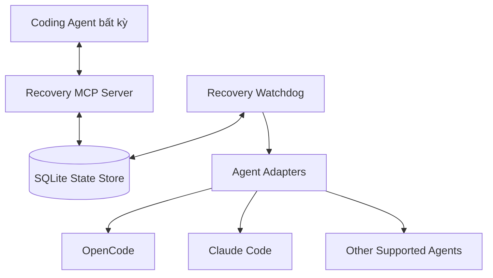

```mermaid
flowchart TB
    A["Coding Agent bất kỳ"]
    M["Recovery MCP Server"]
    DB[("SQLite State Store")]
    W["Recovery Watchdog"]
    AD["Agent Adapters"]
    O["OpenCode"]
    C["Claude Code"]
    X["Other Supported Agents"]

    A <--> M
    M <--> DB
    W <--> DB
    W --> AD
    AD --> O
    AD --> C
    AD --> X
```

Nguyên tắc thiết kế: MCP cung cấp công cụ và dữ liệu; Watchdog mới là thành phần chủ động phát hiện và phục hồi. Không để Watchdog phụ thuộc vào việc coding agent còn sống để thực hiện recovery.