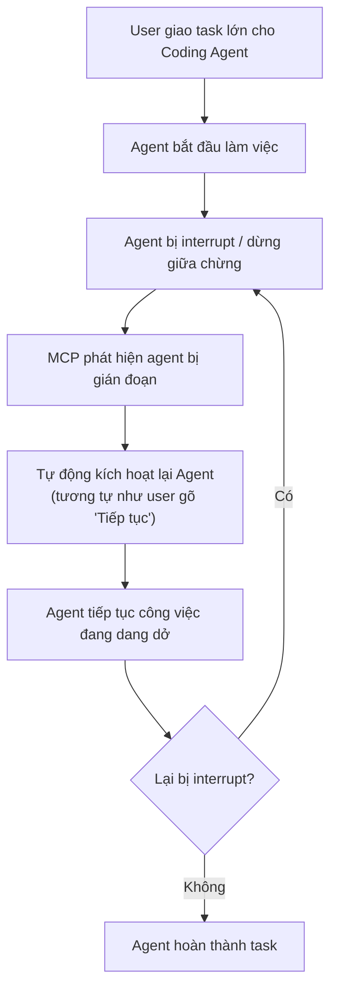

# Use Case: Tự động phục hồi agent bị gián đoạn

```mermaid
flowchart TD
    A["User giao task lớn cho Coding Agent"] --> B["Agent bắt đầu làm việc"]
    B --> C["Agent bị interrupt / dừng giữa chừng"]
    C --> D["MCP phát hiện agent bị gián đoạn"]
    D --> E["Tự động kích hoạt lại Agent<br/>(tương tự như user gõ 'Tiếp tục')"]
    E --> F["Agent tiếp tục công việc đang dang dở"]
    F --> G{"Lại bị interrupt?"}
    G -->|Có| C
    G -->|Không| H["Agent hoàn thành task"]
```
